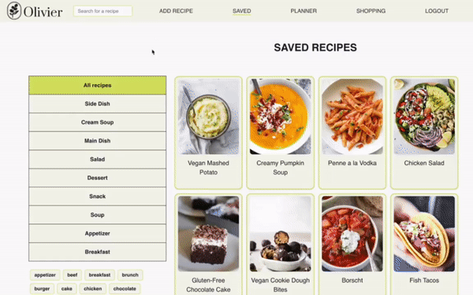
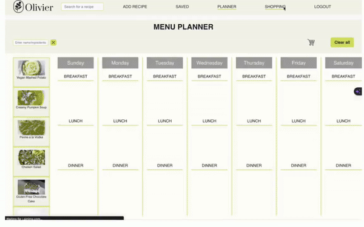

# Olivier's Back-End Repo for Node/React Practicum

Welcome to Olivier's backend repository for the Node/React Practicum. Dive in to set up and operate the backend components crucial for Olivier's operations.

**Front-End Repository:** 
[Link to Front-End Repository](https://github.com/AnnaSolovykh/olivier-front/blob/main/README.md)

## Table of Contents

- [Introduction](#introduction)
  - [Running the project](#running-the-project)
- [Screenshots](#screenshots)
- [User Authentication & Management](#user-authentication--management)
  - [User Authentication](#user-authentication)
  - [Endpoints](#endpoints)
- [Schemas & Data Structures](#schemas--data-structures)
  - [User Schema](#user-schema)
  - [Recipe Schema](#recipe-schema)
  - [Meal Plan Schema](#meal-plan-schema)
  - [ShoppingList Schema](#shoppinglist-schema)
- [Recipe Functionality](#recipe-functionality)
  - [Endpoints](#endpoints-1)
- [Meal Planner Functionality](#meal-planner-functionality)
  - [Endpoints](#endpoints-2)
- [User-Recipe Association](#user-recipe-association)
- [Error Handling](#error-handling)
- [Shopping List API](#shopping-list-api)
  - [Endpoints](#endpoints-3)
- [Mail Functionality](#mail-functionality)
  - [Endpoints](#endpoints-4)
- [Technologies Used](#technologies-used)
- [Authors](#authors)
- [Contributing & Improvements](#contributing--improvements)
- [License](#license)

## Introduction

Olivier combines AI and culinary tradition, revolutionizing kitchens with personalized recipes, meal plans, and shopping lists. More than just recipes, it's a chef and organizer in your pocket.

### Running the project

1. Clone the repository onto your local device (following steps):

```
git clone git@github.com:Code-the-Dream-School/dd-prac-team1-back.git
cd dd-prac-team1-back
npm install
```

2. Set up Mongo database by installing [MongoDB](https://www.mongodb.com/)
3. Obtain the following API Keys:

   - [OPEN AI](https://platform.openai.com/account/api-keys)
   - [Bing](https://portal.azure.com/)
   - [Cloudinary](https://cloudinary.com/)
   - [GoogleAPIs](https://console.cloud.google.com/)

4. Copy the `.env.example` file and rename it to `.env`:

```
cp .env.example .env
```

5. Replace the placeholders with your specific values:

```PORT = <your_desired_port_number>
MONGO_URI = "<your_mongodb_connection_url>"
JWT_SECRET = <your_unique_jwt_secret_key>
JWT_LIFETIME = <your_desired_jwt_lifetime>
SESSION_SECRET = <your_unique_session_secret_key>
NODE_ENV=<your_environment>
OPENAI_API_KEY = <your_openai_api_secret_key>
BING_IMAGE_SEARCH_API_KEY =<your_bing_api_secret_key>
CLOUD_NAME =  <your_cloudinary_cloud_name>
CLOUD_API_KEY = <your_cloudinary_api_key>
CLOUD_API_SECRET = <your_cloudinary_api_secret_key>
FROM_EMAIL = <your_email_address>
CLIENT_ID=<your_client_id>
CLIENT_SECRET=<your_client_secret>
REDIRECT_URI=<your_redirect_uri>
REFRESH_TOKEN=<your_refresh_token>
```

6. Run `npm run start` to start the development server
7. The app will be served at <http://localhost:3000/>.
8. Your back-end server is now running. You can now run the front-end app.

## Screenshots
#### AI Recipe Retrieval
 

#### Manually Add a Recipe


#### Search recipes by category, tag, or keyword. Edit recipe details.


#### Meal Planner


#### Shopping List

## User Authentication & Management
### User Authentication

Managing user sessions and ensuring security is paramount. The process involves:

- Registering new users
- Logging in and out
- Password management (including forgotten and reset functions)

### Endpoints

| HTTP Verbs | Endpoints                          | Action          |
| ---------- | ---------------------------------- | --------------- |
| POST       | /api/v1/auth/register              | Register User   |
| POST       | /api/v1/auth/login                 | Login User      |
| POST       | /api/v1/auth/logout                | Logout User     |
| POST       | /api/v1/auth/forget-password       | Forgot Password |
| PUT        | /api/v1/auth/reset-password/:token | Reset Password  |

**Note**: Proper validation and error handling are implemented for user security.

## Schemas & Data Structures

### User Schema

- Defines user data structure: usernames, emails, and hashed passwords.
- Includes methods for password management and JWT token creation.

### Recipe Schema

- Defines recipe data, including:
  - Name
  - Ingredients
  - Cooking instructions
  - Nutrition info
  - Image, and more.
- Uses subdocuments for ingredients and tags.

### Meal Plan Schema

- Structured to include information like:
  - Date
  - Meals (Breakfast, Lunch, Dinner, Snacks)
  - Notes

### ShoppingList Schema

- Defines shopping list data structure:
  - userId: Link to a unique user
  - Ingredients: List of items with their name, amount, and unit of measurement.

## Recipe Functionality

Allows users to manage their recipes.

### Endpoints

| HTTP Verbs | Endpoints                  | Action               |
| ---------- | -------------------------- | -------------------- |
| POST       | /api/v1/recipes            | Fetch AI Recipe      |
| POST       | /api/v1/recipes/add-ai     | Create AI Recipe     |
| POST       | /api/v1/recipes/add-manual | Create Manual Recipe |
| GET        | /api/v1/recipes            | Get All Recipes      |
| GET        | /api/v1/recipes/:recipeId  | Get Recipe by ID     |
| PATCH      | /api/v1/recipes/:recipeId  | Update Recipe        |
| DELETE     | /api/v1/recipes/:recipeId  | Delete Recipe        |

**Note**: Authentication is required. Only creators can modify their recipes.

## Meal Planner Functionality

Allows users to create, view, update, and delete their meal plans.

### Endpoints

| HTTP Verbs | Endpoints                | Action             |
| ---------- | ------------------------ | ------------------ |
| GET        | /api/v1/meal-planner/    | Get All Meal Plans |
| POST       | /api/v1/meal-planner/    | Create Meal Plan   |
| PUT        | /api/v1/meal-planner/:id | Update Meal Plan   |
| DELETE     | /api/v1/meal-planner/:id | Delete Meal Plan   |

**Note**: Authentication is required. Only the creators can modify their meal plans.

## User-Recipe Association

- When a user creates a recipe, the `recipeCreatedBy` field is assigned their unique ID.
- Authentication tokens ensure security.

## Error Handling

Responses follow a consistent format. Errors return appropriate HTTP status codes and messages.

## Shopping List API

Allows users to manage shopping lists with functionalities like adding recipe ingredients.

### Endpoints

| HTTP Verbs | Endpoints                             | Action                                           |
| ---------- | ------------------------------------- | ------------------------------------------------ |
| POST       | /api/v1/shopping-list/:recipeId       | Add All Ingredients from Recipe to Shopping List |
| GET        | /api/v1/shopping-list                 | Get Shopping List                                |
| DELETE     | /api/v1/shopping-list/:ingredientName | Delete Ingredient                                |
| DELETE     | /api/v1/shopping-list/                | Clear Shopping List                              |
| PUT        | /api/v1/shopping-list/:ingredientName | Update Ingredient Amount                         |
| POST       | /api/v1/shopping-list/add-ingredient  | Add Ingredient                                   |

**Note**: Authentication is required.

## Mail Functionality

### Endpoints

| HTTP Verbs | Endpoints        | Action        |
| ---------- | ---------------- | ------------- |
| POST       | /api/v1/sendmail | Send an Email |

**Note**: Authentication is required. Only authorized users can send emails.

## Technologies Used

- [NodeJS](https://nodejs.org/)
- [ExpressJS](https://www.expresjs.org/)
- [MongoDB](https://www.mongodb.com/)
- [Mongoose ODM](https://mongoosejs.com/)
- [jsonwebtoken](https://jwt.io/)
- [bcryptjs](https://github.com/dcodeIO/bcrypt.js/blob/master/README.md)
- [OPEN AI](https://platform.openai.com/account/api-keys)
- [Bing](https://portal.azure.com/)
- [Cloudinary](https://cloudinary.com/)
- [Nodemailer](https://nodemailer.com/)
- [GoogleAPIs](https://console.cloud.google.com/)

## Authors

| Frontend                                             | Backend                                                |
| ---------------------------------------------------- | ------------------------------------------------------ |
| [Anna Pestova](https://github.com/AnnaPestova1)      | [Aigul Yedigeyeva](https://github.com/AigulY)          |
| [Anna Solovykh](https://github.com/AnnaSolovykh)     | [Elena Cherpakova](https://github.com/ElenaCherpakova) |
| [Elena Gornovoy](https://github.com/ElenaGor8)       |                                                        |
| [Svetlana Beynik](https://github.com/SvetlanaBeynik) |                                                        |

## Contributing & Improvements

We're always looking to improve and enhance our project. If you have suggestions, improvements, or find any bugs, please feel free to open a pull request or an issue on our GitHub repository.

Before submitting a pull request, please ensure the following:

1. Your code is well-documented and follows the project's coding style.
2. Your changes are well-tested and do not introduce new bugs.
3. Include a detailed description of the changes you are proposing.

We appreciate all contributions and look forward to collaborating with you!

## License

This project is available for use under the MIT License.
